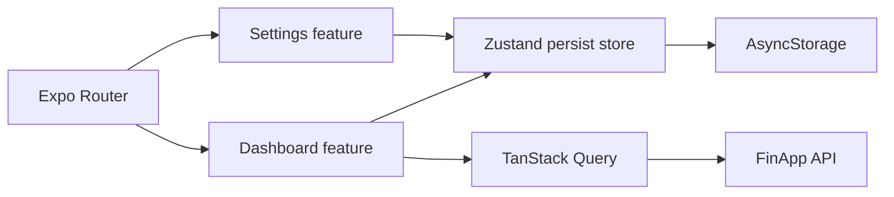
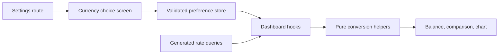
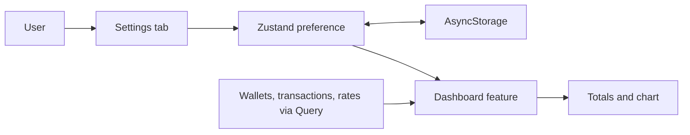
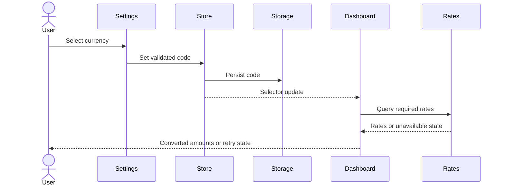

# Design — default display currency

## User outcome and decisions proposed for approval

- A Settings tab lets the user choose UAH, USD, or EUR as the dashboard's display currency. UAH is the initial value.
- The selection persists across app restarts and updates the dashboard immediately.
- The preference changes the wallet total, expense comparison amounts, and expense chart values and axis labels. Individual wallet rows keep their wallet's own currency.
- The preference is local to the device. No backend settings write or API contract change is planned.

## Components and ownership

| Component | Responsibility |
|---|---|
| `src/app/(tabs)/settings.tsx` | Settings route; imports the feature screen |
| `src/app/(tabs)/_layout.tsx` | Settings tab registration |
| `src/features/settings/SettingsScreen/SettingsScreen.tsx` | Accessible currency choices and selected state |
| `src/shared/stores/displayCurrencyStore.ts` | Zustand 5 state, persisted selected code, hydration state, validated restore |
| `src/shared/constants/displayCurrencies.ts` | Allowed ISO currency codes and default |
| `src/features/dashboard/DashboardScreen/` | Selected currency subscription, rate loading, balance and expense presentation |
| `src/features/dashboard/lib/` | Pure conversion and aggregation helpers |

## Data flow

### C4 context

### C4 container

### C4 component

### DFD

### Sequence

On restart, hydration restores the validated preference before currency dependent values are shown.

## Conversion and failure behavior

- Treat API amounts as minor units. Convert source to UAH using the established buy then cross rate; divide by the target currency's buy then cross rate. UAH uses rate 1. Round at presentation, after aggregation.
- Use the transaction wallet currency for expenses. Resolve missing transaction currency through the matching wallet ID; unresolved currency makes the affected dashboard amount unavailable with an explanatory message.
- A missing, zero, invalid, or failed rate must never produce a partial total or a mislabeled value. Show a loading state while rates load and a retryable unavailable state on failure. Keep the saved preference.
- Validate persisted codes against the allowlist; an unknown or corrupt value becomes UAH. Show a neutral loading placeholder until hydration finishes, avoiding a brief incorrect currency label.
- No conversion affects source wallet balances, transaction editing, or backend data.

## Release and verification

- AsyncStorage is a native dependency and is absent. Installation is outside this acceptance run. The implementation phase records its SDK compatible version and changes the lockfile only after the user authorizes installation.
- A native build and runtimeVersion change are expected if AsyncStorage is introduced. The exact runtimeVersion value and release timing require user decision. `expo.version` and `package.json` version target `1.11.0` during the release artifact phase.
- Verify currency switching, relaunch persistence, missing rate behavior, and mixed currency totals manually. Run lint, TypeScript, and `agents:check` in sequence. No test runner or test phase is added.

## Canonical rules

- [Architecture](../../ai/rules/projects/fin-app-mobile/architecture.md)
- [State management](../../ai/rules/projects/fin-app-mobile/state-management.md)
- [Money and TypeScript patterns](../../ai/rules/common/patterns.md)
- [Release versioning](../../ai/rules/common/versioning-changelog.md)
